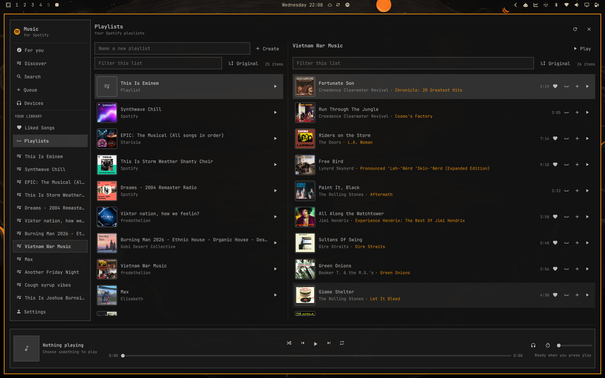
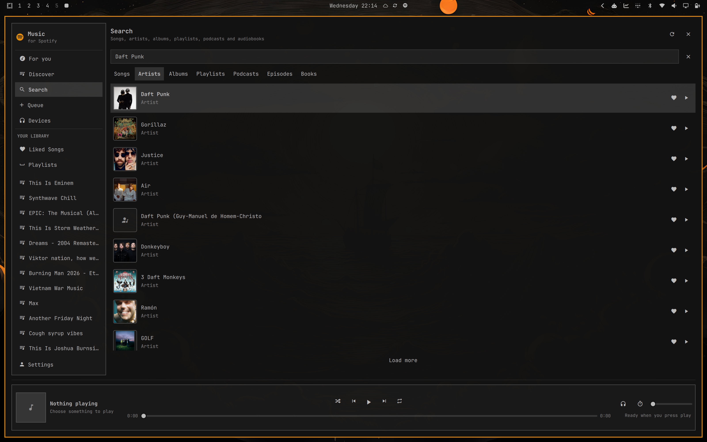
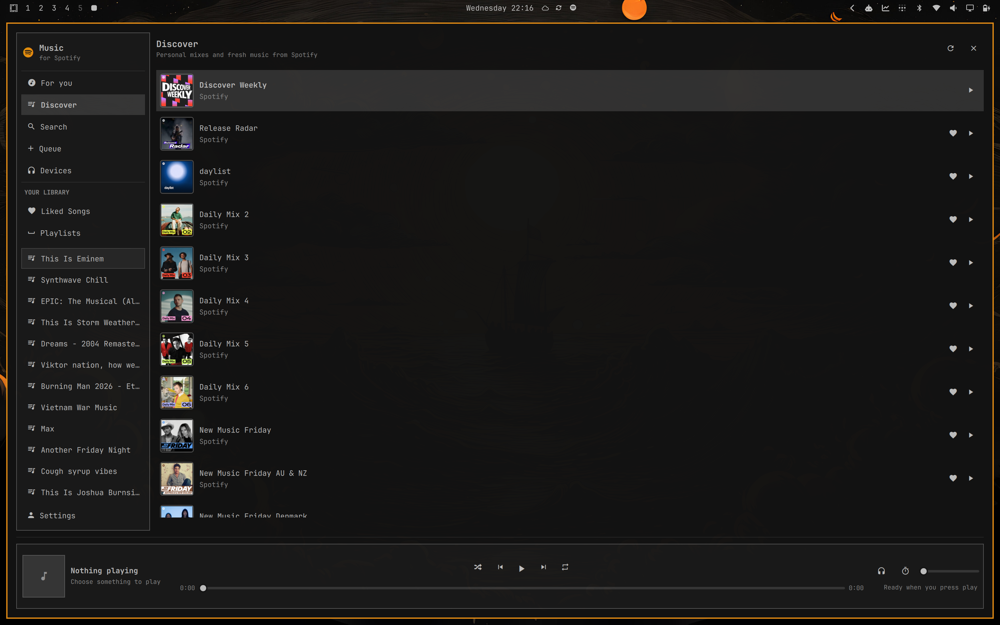

# Music for Spotify

Spotify, built for Omarchy.

Music for Spotify puts search, your library, playlists, queue, playback controls,
and Spotify Connect in one fast, theme-aware Omarchy app. The bar widget keeps
the current song close; the full window gives you room to browse and listen.

> Requires Omarchy 4 and a personal Spotify Premium account.

## Highlights

- Search songs, artists, albums, playlists, podcasts, episodes, and audiobooks.
- Discover Weekly, Release Radar, Daily Mixes, daylist, and fresh Spotify picks
  in a dedicated Discover tab when they are available for your account.
- Browse Liked Songs, saved albums, followed artists, podcasts, and books.
- Open an artist for their **This Is** playlist, top albums and EPs, and top 10
  songs, then search within that artist's catalog.
- Create and edit playlists, manage the queue, and start track radio.
- Turn a followed playlist into your own editable private copy when Spotify
  makes its contents available.
- Play on this computer or switch to another Spotify Connect device.
- Control shuffle, repeat, position, volume, and a flexible sleep timer.
- Match every Omarchy theme automatically, including light themes.
- Stay lightweight: no embedded browser, Electron app, or background polling.

## Install

Install **Music for Spotify** from the Omarchy plugin directory and choose where
you want it in the bar. You can move or disable it later from Omarchy's plugin
and bar settings.

On first launch:

1. Click the Spotify icon in the bar.
2. Choose **Set up and continue**. If the small playback component is missing,
   Omarchy asks for your computer password before installing it.
3. Finish the Spotify approval pages in your browser. Spotify may show two pages
   the first time; complete both and the app brings you back automatically.

That is the whole setup. Playback on this computer starts only when needed and
stops automatically after it has been idle.

## Everyday controls

- Left-click the bar widget for now playing and quick controls.
- Middle-click to play or pause.
- Right-click to open the full app.
- Scroll over the widget for previous or next.
- Use the playlist button on any song or episode to add it to one of your
  playlists or create a new playlist for it.
- Right-click a song or other media row for more actions. Removing something
  from your library is intentionally kept in this menu.
- Use **Devices** to move playback between this computer and Spotify Connect
  speakers or players.

Keyboard shortcuts:

- `Ctrl+K` or `/` — Search
- `Space` — Play or pause
- `Ctrl+Left` / `Ctrl+Right` — Previous or next
- Arrow keys and `Enter` — Move through and open lists
- `Escape` — Close an open menu first, then go back or close the window

## Playlists

Open **Playlists**, enter a name, and choose **Create**. To add music, use the
playlist button on any song or podcast episode and choose the destination. The
same picker can create a new private playlist and add the item in one step.

When a playlist belongs to someone else, choose **Turn into your own playlist**.
The app creates a private copy, copies every song or episode Spotify provides,
and removes the followed original only after the copy succeeds. If Spotify does
not expose that playlist's contents, nothing is removed.

## Settings

Open **Settings** in the app to:

- reconnect Spotify or log out;
- rename how this computer appears in Spotify Connect;
- choose when local playback goes to sleep;
- show or hide the song title in the bar; and
- choose standard, high, or very high audio quality. New installs default to
  very high (320 kbps).

Set idle minutes to `0` only if you want this computer to remain available as a
Spotify Connect target all the time.

## Privacy and security

Your Spotify password is entered only on Spotify's own page. Music for Spotify
never sees it.

The saved Spotify session is stored in GNOME Keyring. Short-lived access data
stays in the Omarchy shell process, sign-in listens only on this computer, and
sensitive values are removed from any error shown in the app. Logging out stops
local playback and clears both saved Spotify sessions.

Like every Omarchy shell plugin, this code runs inside `omarchy-shell` rather
than a sandbox. Install plugins only from sources you trust.

## Troubleshooting

- **A Spotify feature stopped working:** open **Settings** and choose
  **Reconnect Spotify**.
- **Music will not start on this computer:** open **Settings** and check the
  playback status. If offered, choose **Set up playback**.
- **Sign-in did not return to the app:** close any old Spotify approval tabs and
  try again. Another local sign-in already in progress can block the return.
- **A speaker is missing:** make sure it is awake and on the same network, then
  open **Devices** and choose **Refresh**.
- **Spotify reports a temporary limit:** wait for the time shown in the app,
  then try again.

## Remove

Log out from **Settings** first, then remove the plugin from Omarchy's plugin
manager. The small playback package is kept because another Spotify client may
also use it; inactive local setup files are harmless.

For complete runtime cleanup, see the [technical notes](docs/TECHNICAL.md#complete-removal).

## Known limits

- Spotify requires Premium for playback control and Spotify Connect transfers.
- Some playlists that you do not own may not expose their contents, but can
  still be played as a playlist. Spotify must expose the contents before the
  app can turn one into your own copy.
- Speaker availability is ultimately controlled by Spotify and the device.
- The local playback component is community-maintained and is not an official
  Spotify desktop client.

Music for Spotify is an independent project and is not affiliated with Spotify.
Spotify is a trademark of Spotify AB.

Technical architecture, development setup, and verification are documented in
[Technical notes](docs/TECHNICAL.md). Resource measurements are in
[Benchmark](docs/BENCHMARK.md).

Licensed under the [MIT License](LICENSE).
